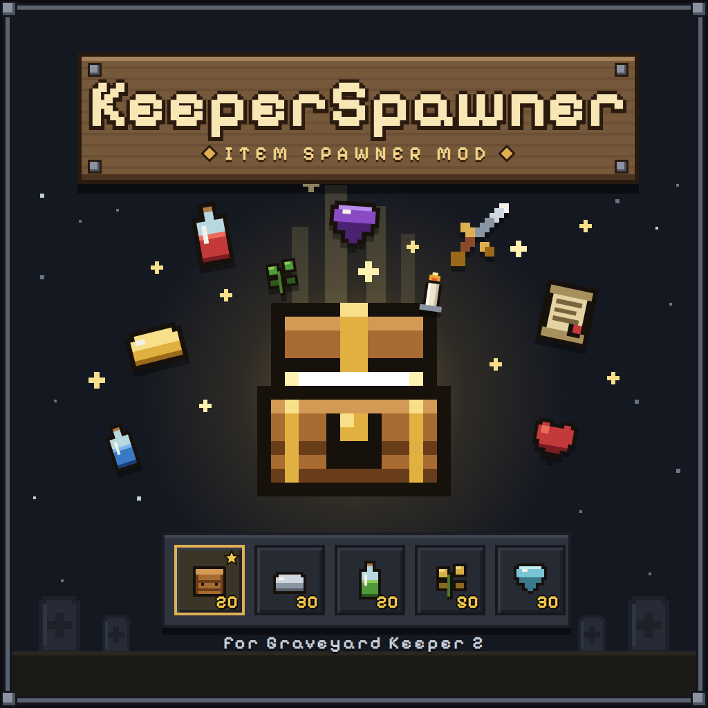
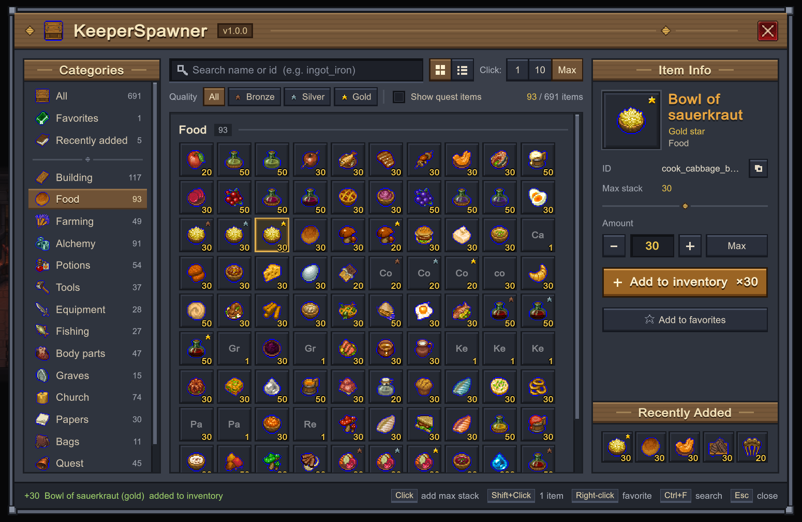
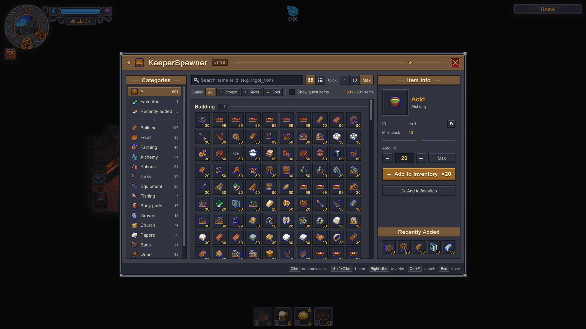
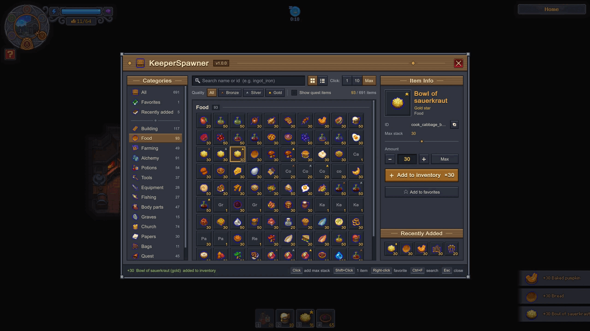
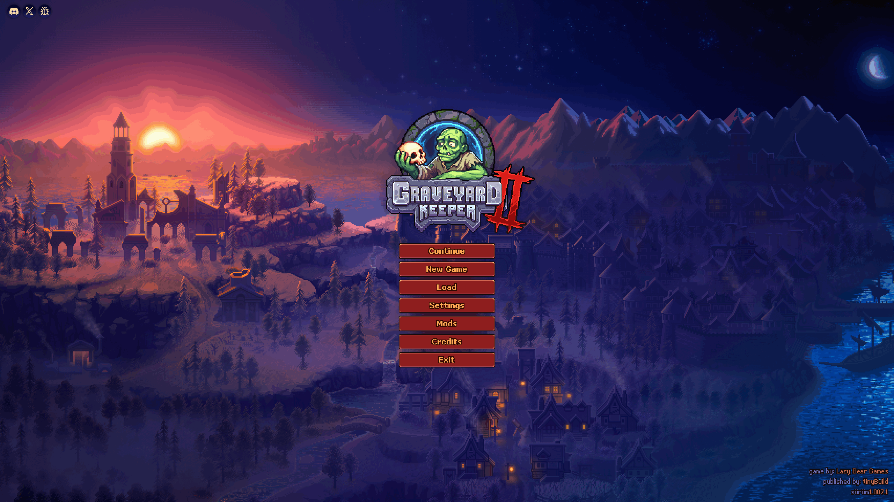

<p align="center">
  
</p>

# KeeperSpawner

Item spawner mod for **Graveyard Keeper 2** (BepInEx 5). Press **O** in game, find an item and click it to add it to your inventory.

[Türkçe](#türkçe) · [Steam Workshop](https://steamcommunity.com/sharedfiles/filedetails/?id=3810736028) · [Nexus Mods](https://www.nexusmods.com/graveyardkeeper2/mods/275) · [Releases](../../releases)



## Features

- All 726 regular items with the game's own icons, names in your game language and bronze / silver / gold quality stars
- 15 categories: building, food, farming, alchemy, potions, tools, equipment, fishing, body parts, graves, church, papers, bags, quest, other
- Search by name or id, accent-insensitive
- Quality filter, grid or list view
- Click adds 1, 10 or a full stack; Shift+Click adds 1; the info panel adds any amount from 1 to 999
- Favorites (right-click) and the last 5 added items
- Quest items hidden by default, so you do not break quests by accident
- UI in all 17 languages of the game
- Switches itself off with a log message, instead of breaking the game, if a game update changes the code it relies on
- Shows up in the game's **Mods** menu when [GK2 Mod Framework](https://www.nexusmods.com/graveyardkeeper2/mods/42) is installed (optional)

## Screenshots

<p>
  
  
  
</p>

More in [docs/images/gallery](docs/images/gallery).

## Requirements

- Graveyard Keeper 2 (tested with 1.007.1)
- [BepInEx 5.4.23.5 (win_x64)](https://github.com/BepInEx/BepInEx/releases/tag/v5.4.23.5)
- Optional: [GK2 Mod Framework](https://www.nexusmods.com/graveyardkeeper2/mods/42) 0.1.19 or newer, for the in-game Mods menu and settings
- Optional: GK2 Workshop Loader, to install it from the Steam Workshop

## Installation

**With the GK2 Workshop Loader:**

1. Install BepInEx (step 1 of the manual install below).
2. Put [`GK2_WorkshopLoader.dll`](https://github.com/Zoriten/-GK2-WorkshopLoader/releases) into `Graveyard Keeper 2\BepInEx\patchers\` (not `plugins`).
3. Subscribe to [KeeperSpawner on the Steam Workshop](https://steamcommunity.com/sharedfiles/filedetails/?id=3810736028), start the game and click **Yes** in the loader's security check.

**Manually:**

1. Extract `BepInEx_win_x64_5.4.23.5.zip` next to `GraveyardKeeper2.exe`, start the game once and close it.
2. Download `KeeperSpawner-<version>.zip` from [Releases](../../releases) or [Nexus Mods](https://www.nexusmods.com/graveyardkeeper2/mods/275) and extract it into the game folder, so that you get
   `Graveyard Keeper 2\BepInEx\plugins\KeeperSpawner\KeeperSpawner.dll`.

The package also contains `KeeperSpawner.GK2Framework.dll`, the optional bridge to GK2 Mod Framework. Without the Framework, BepInEx skips it with a "missing dependencies" line in the log; that is expected and KeeperSpawner still works.

Do not install KeeperSpawner both from the Workshop and manually: BepInEx loads only one copy. To uninstall, delete the `BepInEx\plugins\KeeperSpawner` folder.

## GK2 Mod Framework

With [GK2 Mod Framework](https://www.nexusmods.com/graveyardkeeper2/mods/42) installed, open **Mods** from the main menu or the pause menu and select KeeperSpawner. It shows the version, whether the mod is active and which key opens it, and lets you change the hotkey, amount per click, quest items, view, UI scale and background dimming. The values are KeeperSpawner's own config entries, so the Mods menu and the `.cfg` file always agree.

## Controls

| Key | Action |
|---|---|
| O | Open / close (configurable) |
| Click | Add the amount selected under "Click" (1 / 10 / Max) |
| Shift+Click | Add 1 |
| Right-click | Add / remove favorite |
| Ctrl+F | Search |
| Esc | Leave the search box, then close |

## Configuration

`BepInEx\config\com.mrkacmaz.keeperspawner.cfg` is created on the first start.

| Setting | Default | Description |
|---|---|---|
| `General.ToggleKey` | `O` | Key that opens the window |
| `Items.ShowQuestItems` | `false` | Show quest items (can break quests) |
| `UI.ClickAmount` | `Max` | Amount per click: `One`, `Ten`, `Max` |
| `UI.View` | `Grid` | `Grid` or `List` |
| `UI.Scale` | `0` | UI scale, `0` = automatic (screen height / 1080) |
| `UI.BackdropOpacity` | `0.55` | How much the game is dimmed behind the window |
| `UI.Font` | empty | UI font: empty = automatic, `-` = Unity default, or a font name from the log |
| `Items.Favorites`, `Items.Recent`, `UI.Category` | | Saved by the window |
| `Debug.ForceIncompatible` | `false` | Test the "incompatible game version" path |

## Troubleshooting

**Nothing happens when I press O.**

- Load a save first. The window does not open in the main menu.
- The key is the letter **O**, not the number zero. You can change it in the config or in the Mods menu.
- Open `Graveyard Keeper 2\BepInEx\LogOutput.log` and look for `KeeperSpawner 1.1.0 loaded`. If the line is missing, BepInEx did not load the mod: check that `BepInEx\plugins\KeeperSpawner\KeeperSpawner.dll` exists and that BepInEx itself starts (it creates `BepInEx\LogOutput.log`).
- `KeeperSpawner disabled: ...` in the log means a game update changed something the mod needs. Please report it with the log.

**KeeperSpawner is missing from the Mods menu.** `KeeperSpawner.GK2Framework.dll` must be next to `KeeperSpawner.dll`, and you need KeeperSpawner 1.1.0+ and GK2 Mod Framework 0.1.19+. The log should contain `Registered GK2 mod [com.mrkacmaz.keeperspawner]`.

## Compatibility

At startup the mod checks the game members it uses. If a game update removes or changes one of them, the mod switches itself off and writes the reason to `BepInEx\LogOutput.log`; pressing the hotkey then shows a notice. Optional parts (the game's own "+N item" notification, item icons) only turn themselves off.

The mod does not use the network, does not delete files and does not load other code. It uses reflection only to read and reset the game's input state while the window is open.

## Bug reports

Found a bug or have an idea? [Open an issue](../../issues/new/choose). For bugs, please attach `Graveyard Keeper 2\BepInEx\LogOutput.log` from a session where the problem happened.

## Building

Requirements: .NET SDK 8 (or newer), the game with BepInEx installed. The optional Framework bridge (`src/KeeperSpawner.GK2Framework`) also needs [GK2 Mod Framework](https://www.nexusmods.com/graveyardkeeper2/mods/42) installed in the game (`BepInEx\plugins\GK2.Framework.dll`).

1. Create `Directory.Build.props.user` in the repository root (it is git-ignored):

   ```xml
   <Project>
     <PropertyGroup>
       <GamePath>C:\Program Files (x86)\Steam\steamapps\common\Graveyard Keeper 2</GamePath>
     </PropertyGroup>
   </Project>
   ```

2. Build. The DLLs are copied to `BepInEx\plugins\KeeperSpawner\` of the game automatically. Building the bridge builds the main mod too; build only `src\KeeperSpawner\KeeperSpawner.csproj` if you do not have the Framework.

   ```
   dotnet build src\KeeperSpawner.GK2Framework\KeeperSpawner.GK2Framework.csproj -c Release
   ```

3. Release package (Workshop folder, manual-install zip, SteamCMD vdf) in `artifacts\<version>\`:

   ```
   powershell -ExecutionPolicy Bypass -File tools\package.ps1
   ```

The game and BepInEx assemblies are referenced from the game folder and are not part of this repository. Notes on the game API the mod uses are in [docs/game-api.md](docs/game-api.md); UnityExplorer console scripts used for that research are in [tools/ue](tools/ue).

## License

[MIT](LICENSE). Graveyard Keeper 2 and its assets belong to Lazy Bear Games and tinyBuild; this project is not affiliated with them.

---

## Türkçe

**Graveyard Keeper 2** için item spawner modu (BepInEx 5). Oyunda **O**'ya bas, itemı bul ve tıklayarak envanterine ekle.

### Özellikler

- Oyunun kendi ikonlarıyla 726 normal item; adlar oyunun dilinde, bronz / gümüş / altın kalite yıldızlarıyla
- 15 kategori, isim ya da id ile Türkçe harflere duyarsız arama ("kilic" yazınca "Kılıç" bulunur)
- Kalite filtresi, ızgara ya da liste görünümü
- Tık 1, 10 ya da tam yığın ekler; Shift+Tık 1 adet ekler; bilgi panelinden 1–999 arası miktar
- Favoriler (sağ tık) ve son eklenen 5 item
- Görev itemları varsayılan olarak gizli
- Arayüz oyunun 17 dilinin hepsinde
- Bir oyun güncellemesi kullandığı kodu değiştirirse oyunu bozmak yerine kendini kapatır ve sebebini loga yazar
- [GK2 Mod Framework](https://www.nexusmods.com/graveyardkeeper2/mods/42) kuruluysa oyunun **Mods** menüsünde görünür; ayarlar oradan da değiştirilebilir (isteğe bağlı)

### Kurulum

**GK2 Workshop Loader ile:**

1. BepInEx'i kur (aşağıdaki elle kurulumun 1. adımı).
2. [`GK2_WorkshopLoader.dll`](https://github.com/Zoriten/-GK2-WorkshopLoader/releases) dosyasını `Graveyard Keeper 2\BepInEx\patchers\` klasörüne koy (`plugins` değil).
3. [Steam Atölyesi'nde KeeperSpawner](https://steamcommunity.com/sharedfiles/filedetails/?id=3810736028)'a abone ol, oyunu aç ve loader'ın güvenlik penceresinde **Evet**'e bas.

**Elle:**

1. [BepInEx 5.4.23.5 (win_x64)](https://github.com/BepInEx/BepInEx/releases/tag/v5.4.23.5) zip'ini `GraveyardKeeper2.exe`'nin yanına çıkar, oyunu bir kez açıp kapat.
2. [Releases](../../releases) ya da [Nexus Mods](https://www.nexusmods.com/graveyardkeeper2/mods/275) sayfasından `KeeperSpawner-<sürüm>.zip` dosyasını indirip oyun klasörüne çıkar; sonuç
   `Graveyard Keeper 2\BepInEx\plugins\KeeperSpawner\KeeperSpawner.dll` olmalı.

Paketteki `KeeperSpawner.GK2Framework.dll`, GK2 Mod Framework için isteğe bağlı köprüdür. Framework yoksa BepInEx onu logda "missing dependencies" yazarak atlar; bu normaldir, KeeperSpawner yine çalışır.

KeeperSpawner'ı hem Atölye'den hem elle kurma; BepInEx sadece birini yükler. Kaldırmak için `BepInEx\plugins\KeeperSpawner` klasörünü sil.

### GK2 Mod Framework

[GK2 Mod Framework](https://www.nexusmods.com/graveyardkeeper2/mods/42) (0.1.19 ya da üstü) kuruluysa ana menüden ya da duraklatma menüsünden **Mods**'u açıp KeeperSpawner'ı seç. Sürümü, modun etkin olup olmadığını ve hangi tuşla açıldığını gösterir; açma tuşu, tık başına miktar, görev itemları, görünüm, arayüz ölçeği ve arka plan karartma oradan değiştirilebilir. Değerler KeeperSpawner'ın kendi ayar dosyasına yazılır.

### Tuşlar

| Tuş | İşlev |
|---|---|
| O | Aç / kapat (değiştirilebilir) |
| Tık | "Tık" altında seçili miktarı ekle (1 / 10 / Maks) |
| Shift+Tık | 1 adet ekle |
| Sağ tık | Favorilere ekle / çıkar |
| Ctrl+F | Arama |
| Esc | Önce arama kutusundan çık, sonra kapat |

Ayarlar `BepInEx\config\com.mrkacmaz.keeperspawner.cfg` dosyasında (tablo yukarıda, İngilizce bölümde).

### Sorun giderme

**O'ya basınca bir şey olmuyor.** Önce bir kayıt yükle (pencere ana menüde açılmaz). Tuş sıfır değil, **O** harfi. `BepInEx\LogOutput.log` içinde `KeeperSpawner 1.1.0 loaded` satırı yoksa BepInEx modu yüklememiştir; `BepInEx\plugins\KeeperSpawner\KeeperSpawner.dll` dosyasının yerinde olduğunu kontrol et. `KeeperSpawner disabled: ...` satırı, bir oyun güncellemesinden sonra uyumsuzluk demektir; logla birlikte bildir.

**Mods menüsünde KeeperSpawner yok.** `KeeperSpawner.GK2Framework.dll` dosyası `KeeperSpawner.dll`'in yanında olmalı; KeeperSpawner 1.1.0+ ve GK2 Mod Framework 0.1.19+ gerekir. Logda `Registered GK2 mod [com.mrkacmaz.keeperspawner]` satırı görünmeli.

### Uyumluluk

Oyun sürümü 1.007.1 ile test edildi. Mod açılışta kullandığı oyun kodunu kontrol eder; bir şey değiştiyse kendini kapatır ve sebebini `BepInEx\LogOutput.log` dosyasına yazar. Ağ kullanmaz, dosya silmez, başka kod yüklemez.

### Hata bildirimi

Bir hata ya da fikrin mi var? [Issue aç](../../issues/new/choose). Hatalarda, sorunun yaşandığı oturumdan `Graveyard Keeper 2\BepInEx\LogOutput.log` dosyasını ekle.

### Lisans

[MIT](LICENSE). Graveyard Keeper 2 ve varlıkları Lazy Bear Games ile tinyBuild'e aittir; bu proje onlarla bağlantılı değildir.
