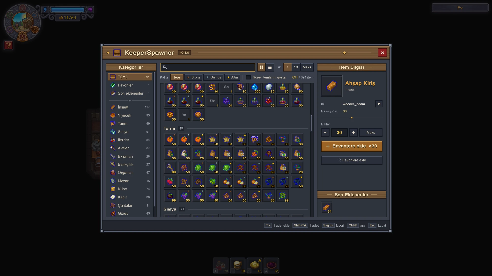

# KeeperSpawner

Item spawner mod for **Graveyard Keeper 2** (BepInEx 5). Press **O** in game, find an item and click it to add it to your inventory.

[Türkçe](#türkçe)



## Features

- All 726 regular items with the game's own icons, names in your game language and bronze / silver / gold quality stars
- 15 categories: building, food, farming, alchemy, potions, tools, equipment, fishing, body parts, graves, church, papers, bags, quest, other
- Search by name or id, accent-insensitive
- Quality filter, grid or list view
- Click adds 1, 10 or a full stack; Shift+Click adds 1; the info panel adds any amount from 1 to 999
- Favorites (right-click) and the last 5 added items
- Quest items hidden by default, so you do not break quests by accident
- UI in all 17 languages of the game
- Switches itself off with a log message, instead of breaking the game, if a game update changes the code it relies on

## Requirements

- Graveyard Keeper 2 (tested with 1.007.1)
- [BepInEx 5.4.23.5 (win_x64)](https://github.com/BepInEx/BepInEx/releases/tag/v5.4.23.5)
- Optional: GK2 Workshop Loader, to install it from the Steam Workshop

## Installation

**With the GK2 Workshop Loader:** install BepInEx and the loader, subscribe to KeeperSpawner on the Steam Workshop and approve it in the loader.

**Manually:**

1. Extract `BepInEx_win_x64_5.4.23.5.zip` next to `GraveyardKeeper2.exe`, start the game once and close it.
2. Download `KeeperSpawner-<version>.zip` from [Releases](../../releases) and extract it into the game folder, so that you get
   `Graveyard Keeper 2\BepInEx\plugins\KeeperSpawner\KeeperSpawner.dll`.

To uninstall, delete the `BepInEx\plugins\KeeperSpawner` folder.

## Controls

| Key | Action |
|---|---|
| O | Open / close (configurable) |
| Click | Add the amount selected under "Click" (1 / 10 / Max) |
| Shift+Click | Add 1 |
| Right-click | Add / remove favorite |
| Ctrl+F | Search |
| Esc | Leave the search box, then close |

## Configuration

`BepInEx\config\com.mrkacmaz.keeperspawner.cfg` is created on the first start.

| Setting | Default | Description |
|---|---|---|
| `General.ToggleKey` | `O` | Key that opens the window |
| `Items.ShowQuestItems` | `false` | Show quest items (can break quests) |
| `UI.ClickAmount` | `Max` | Amount per click: `One`, `Ten`, `Max` |
| `UI.View` | `Grid` | `Grid` or `List` |
| `UI.Scale` | `0` | UI scale, `0` = automatic (screen height / 1080) |
| `UI.BackdropOpacity` | `0.55` | How much the game is dimmed behind the window |
| `UI.Font` | empty | UI font: empty = automatic, `-` = Unity default, or a font name from the log |
| `Items.Favorites`, `Items.Recent`, `UI.Category` | | Saved by the window |
| `Debug.ForceIncompatible` | `false` | Test the "incompatible game version" path |

## Compatibility

At startup the mod checks the game members it uses. If a game update removes or changes one of them, the mod switches itself off and writes the reason to `BepInEx\LogOutput.log`; pressing the hotkey then shows a notice. Optional parts (the game's own "+N item" notification, item icons) only turn themselves off.

The mod does not use the network, does not delete files and does not load other code. It uses reflection only to read and reset the game's input state while the window is open.

## Bug reports

Found a bug or have an idea? [Open an issue](../../issues/new/choose). For bugs, please attach `Graveyard Keeper 2\BepInEx\LogOutput.log` from a session where the problem happened.

## Building

Requirements: .NET SDK 8 (or newer), the game with BepInEx installed.

1. Create `Directory.Build.props.user` in the repository root (it is git-ignored):

   ```xml
   <Project>
     <PropertyGroup>
       <GamePath>C:\Program Files (x86)\Steam\steamapps\common\Graveyard Keeper 2</GamePath>
     </PropertyGroup>
   </Project>
   ```

2. Build. The DLL is copied to `BepInEx\plugins\KeeperSpawner\` of the game automatically.

   ```
   dotnet build src\KeeperSpawner\KeeperSpawner.csproj -c Release
   ```

3. Release package (Workshop folder, manual-install zip, SteamCMD vdf) in `artifacts\<version>\`:

   ```
   powershell -ExecutionPolicy Bypass -File tools\package.ps1
   ```

The game and BepInEx assemblies are referenced from the game folder and are not part of this repository. Notes on the game API the mod uses are in [docs/game-api.md](docs/game-api.md); UnityExplorer console scripts used for that research are in [tools/ue](tools/ue).

## License

[MIT](LICENSE). Graveyard Keeper 2 and its assets belong to Lazy Bear Games and tinyBuild; this project is not affiliated with them.

---

## Türkçe

**Graveyard Keeper 2** için item spawner modu (BepInEx 5). Oyunda **O**'ya bas, itemı bul ve tıklayarak envanterine ekle.

### Özellikler

- Oyunun kendi ikonlarıyla 726 normal item; adlar oyunun dilinde, bronz / gümüş / altın kalite yıldızlarıyla
- 15 kategori, isim ya da id ile Türkçe harflere duyarsız arama ("kilic" yazınca "Kılıç" bulunur)
- Kalite filtresi, ızgara ya da liste görünümü
- Tık 1, 10 ya da tam yığın ekler; Shift+Tık 1 adet ekler; bilgi panelinden 1–999 arası miktar
- Favoriler (sağ tık) ve son eklenen 5 item
- Görev itemları varsayılan olarak gizli
- Arayüz oyunun 17 dilinin hepsinde
- Bir oyun güncellemesi kullandığı kodu değiştirirse oyunu bozmak yerine kendini kapatır ve sebebini loga yazar

### Kurulum

**GK2 Workshop Loader ile:** BepInEx'i ve loader'ı kur, Steam Atölyesi'nde KeeperSpawner'a abone ol ve loader'da onayla.

**Elle:**

1. [BepInEx 5.4.23.5 (win_x64)](https://github.com/BepInEx/BepInEx/releases/tag/v5.4.23.5) zip'ini `GraveyardKeeper2.exe`'nin yanına çıkar, oyunu bir kez açıp kapat.
2. [Releases](../../releases) sayfasından `KeeperSpawner-<sürüm>.zip` dosyasını indirip oyun klasörüne çıkar; sonuç
   `Graveyard Keeper 2\BepInEx\plugins\KeeperSpawner\KeeperSpawner.dll` olmalı.

Kaldırmak için `BepInEx\plugins\KeeperSpawner` klasörünü sil.

### Tuşlar

| Tuş | İşlev |
|---|---|
| O | Aç / kapat (değiştirilebilir) |
| Tık | "Tık" altında seçili miktarı ekle (1 / 10 / Maks) |
| Shift+Tık | 1 adet ekle |
| Sağ tık | Favorilere ekle / çıkar |
| Ctrl+F | Arama |
| Esc | Önce arama kutusundan çık, sonra kapat |

Ayarlar `BepInEx\config\com.mrkacmaz.keeperspawner.cfg` dosyasında (tablo yukarıda, İngilizce bölümde).

### Uyumluluk

Oyun sürümü 1.007.1 ile test edildi. Mod açılışta kullandığı oyun kodunu kontrol eder; bir şey değiştiyse kendini kapatır ve sebebini `BepInEx\LogOutput.log` dosyasına yazar. Ağ kullanmaz, dosya silmez, başka kod yüklemez.

### Hata bildirimi

Bir hata ya da fikrin mi var? [Issue aç](../../issues/new/choose). Hatalarda, sorunun yaşandığı oturumdan `Graveyard Keeper 2\BepInEx\LogOutput.log` dosyasını ekle.

### Lisans

[MIT](LICENSE). Graveyard Keeper 2 ve varlıkları Lazy Bear Games ile tinyBuild'e aittir; bu proje onlarla bağlantılı değildir.
